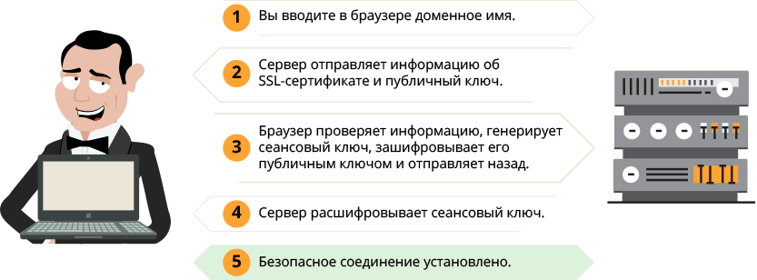

* Что такое модель OSI, TCP/IP?

  
Ответ

  
  
  
  https://community.fs.com/ru/blog/tcpip-vs-osi-whats-the-difference-between-the-two-models.html
  #### Уровень 1: физический уровень
  
Физический уровень определяет электрические и физические характеристики соединения данных. Например, расположение штырей разъема, рабочие напряжения электрического кабеля, спецификации оптоволоконного кабеля и частота для беспроводных устройств. Он отвечает за обмен физическими сигналами между физическими устройствами и аппаратурами. Управление скоростью передачи битов осуществляется на физическом уровне. Это уровень сетевого оборудования низкого уровня и никогда не касается протоколов или других элементов более высокого уровня.

  #### Уровень 2: канальный уровень

  Канальный уровень предназначен для обеспечения взаимодействия сетей на физическом уровне и контроля ошибок, которые могут возникнуть. И второй уровень также решает проблему адресации при передаче информации. Полученные с физического уровня данные, представленные в битах, он упаковывает в кадры, проверяет их на целостность и, если нужно, исправляет ошибки (формирует повторный запрос повреждённого кадра) и отправляет на сетевой уровень. Канальный уровень обычно делится на два подуровня - уровень media access control (MAC) layer и logical link control (LLC) . Уровень MAC отвечает за управление тем, как устройства в сети получают доступ к мультимедиа и разрешение на передачу данных. Уровень LLC отвечает за идентификацию и инкапсуляцию протоколов сетевого уровня, а также контролирует проверку ошибок и синхронизацию кадров.

  #### Уровень 3: сетевой уровень
  Сетевой уровень обрабатывает маршрутизацию пакетов через логическую адресацию и функции коммутации. Сеть - это среда, к которой можно подключить множество узлов. У каждого узла есть адрес. Когда узел должен передать сообщение другим узлам, он может просто предоставить содержание СМС и адреса узла назначения, затем сеть найдет способ доставки сообщения узлу назначения, возможно через другие узлы. Если сообщение слишком длинное, сеть может разделить его на несколько сегментов на одном узле, отправив их отдельно и повторно собрав фрагменты на другом узле.

  #### Уровень 4: транспортный уровень
  Транспортный уровень обеспечивает функции и средства передачи последовательностей данных от источника к хосту назначения через одну или несколько сетей, сохраняя при этом функции quality of service (QoS) и обеспечивая полную доставку данных. Целостность данных может быть гарантирована через исправление ошибок и аналогичные функции. Он также может предоставить явную функцию управления потоком. Наиболее чувствительных к потерям на транспортном уровне используется протокол TCP, контролирующий целостность доставленной информации. Поэтому, протокол TCP используется для передачи четкой информации: картинки, тексты, файлы. Для передачи таких данных, наиболее чувствительных к задержкам, используется протокол UDP, позволяющий организовать связь без установки соединения. UDP же чаще всего используются в потоках: видео, аудио, онлайн-игры и т.д.

  #### Уровень 5: сеансовый уровень
  Сеансовый уровень управляет диалогами (соединениями) между компьютерами. Он устанавливает, управляет, сохраняет и в конечном итоге разрывает соединения между локальным и удаленным приложением. Программное обеспечение уровня 5 также выполняет функции аутентификации и авторизации. Он проверяет, что данные также доставляются. Сеансовый уровень обычно реализуется явно в прикладных средах, которые используют удаленные вызовы процедур. Например, во время видеосвязи необходимо, чтобы два потока данных (аудио и видео) шли синхронно. Когда к разговору двоих человек прибавится третий — получится уже конференция. Задача пятого уровня — сделать так, чтобы собеседники могли понять, кто сейчас говорит.

  #### Уровень 6: уровень представления
  Уровень представления проверяет данные, чтобы обеспечить его совместимость с коммуникационными ресурсами. Он переводит данные в форму, что прикладной уровень и более низкие уровни принимают. Уровень представления обеспечивает преобразование протоколов и кодирование/декодирование данных. Например, когда одно устройство умеет отображать текст только в кодировке ASCII, а другое только в UTF-8, перевод текста из одной кодировки в другую происходит на шестом уровне. Запросы приложений, полученные с прикладного уровня, на уровне представления преобразуются в формат для передачи по сети, а полученные из сети данные преобразуются в формат приложений. На этом уровне может осуществляться сжатие/распаковка или шифрование/дешифрование, а также перенаправление запросов другому сетевому ресурсу, если они не могут быть обработаны локально.

  #### Уровень 7: прикладной уровень
  Прикладной уровень модели OSI напрямую взаимодействует с применениями программных обеспечений для предоставления необходимых функций связи, и он наиболее близок к конечным пользователям. Функции прикладного уровня обычно включают в себя проверку доступности коммуникационных партнеров и ресурсов для поддержки любой передачи данных. Другими словами, все услуги, получаемые седьмым уровнем от других, используются для доставки данных до пользователя. Этот уровень также определяет протоколы для конечных применений, такие как domain name system (DNS), file transfer protocol (FTP), hypertext transfer protocol (HTTP), Internet message access protocol (IMAP), post office protocol (POP), simple mail transfer protocol (SMTP), Simple Network Management Protocol (SNMP), и Telnet (a terminal emulation).

*  Для чего нужны network masks?

  
Ответ

  
  Маска подсети указывает, какие разряды IP-адреса относятся к адресу хоста. Эта битовая маска выделяет из IP-адреса адрес сети и адрес подсети. 
  https://habr.com/ru/post/129664/
  

*  Структура IP-пакета. Из чего состоит? Что такое фрагментация и почему она происходит?

  
Ответ

  
  IP (Internet Protocol) - протокол сетевого уровня стека TCP/IP.

  Основной задачей протокола является доставка датаграмм между хостами сетей TCP/IP через произвольное число промежуточных узлов (маршрутизаторов)
  
  
  
  MTU определяет максимальную длину блока данных, которую данная сетевая среда в состоянии перенести. Если блок данных имеет большую длину, он автоматически разбивается на кусочки меньшей длины, каждый из которых передается затем по отдельности.

  Фрагментация — это процесс разбиения отдельного пакета данных на некоторое количество пакетов помельче. Фрагментация происходит в случае, если длина пакета превосходит MTU физического сетевого уровня. Однако она также происходит, когда пакет попадает в маршрутизатор с MTU меньшим, нежели MTU локальной сети источника. Для управления фрагментацией IP использует первый и последний биты в трехбитовом поле флагов. Первый бит называется «фрагментация запрещена» и устанавливается сетевым программным обеспечением для тестирования и отладки. Существуют некоторые приложения, данные которых действительно нельзя фрагментировать. Включая режим «фрагментация запрещена», то есть устанавливая соответствующий бит, имейте в виду, что если модуль IP обнаружит, что фрагментация все-таки должна произойти, протокол TCP/IP отбросит IP-пакет и вернет сообщение об ошибке источнику пакета.
  
  https://libraryno.ru/2-5-5-fragmentaciya-progr_in_inet/
  
 

 
 * Что такое коллизия? Почему возникает?
 
 

  
Ответ

  Коллизия (англ. collision — ошибка наложения, столкновения) — в терминологии компьютерных и сетевых технологий наложение двух и более кадров от станций, пытающихся передать кадр в один и тот же момент времени в среде передачи коллективного доступа.
  
  https://lectures.net.ru/lan/1/
  

 
* Вы вводите в строке браузера yandex.ru. Опишите процесс от нажатия клавиши до загрузки страницы.

  
Ответ

Любой URL содержит следующую структуру `<протокол>/<хост>/путь`, например `https://yandex.ru/pogoda/samara`. Также URL может содержать данные для отображения страницы.

1. При вводе URL браузер смотрит на протокол запроса. Если протокол в URL не указан, то браузер смотрит на список HSTS (HTTP Strict Transport Security - механизм, принудительно активирующий защищенное соединение через протокол HTTPS), если хост есть в данном списке, то браузер отправит запрос по протоколу HTTPS, если нет, то по HTTP.

2. Для того, чтобы установить соединение с сервером, необходим его IP адрес. Так как мы используем домен, то необходимо установить соответствие домена и IP адреса сервера, где размещается ресурс. При запросе мы обращаемся к DNS. Cначала проверяется кеш DNS. Приоритет опроса DNS кеша следующий:
 - Кеш браузера,
 - Проверяется hosts файл ,
 - Кеш ОС,
 - Кеш роутера,
 - Кеш интернет-провайдера
Если данных о данном запрашиваеомом хосте в кеше нет, то:
 - DNS интернет провайдера отправляет запрос к контевому серверу DNS (.),
 - Если корневой сервер не знает запрашиваемого домена, то он отправляет запрос серверу ответственному за зону (.ru), в которому привязан домен,
 - Если DNS сервер зоны не знает запрашиваемого домена, то запрос отправляется к NS серверу домена.
IP адрес хоста, при его наличии у DNS сервера, возвращается обратно по цепочке

3. После того, как IP адрес хоста получили, необходимо сформировать на прикладном уровне запрос к серверу. К запросу добавляются следующие заголовки:
 - Прикладной уровень: протокол запроса (HTTP/S, FTP и т.д),
 - Транспортный (TCP/UDP): порт, по которому обращаемся к серверу.
 - Сетевой уровень: IP адрес пакета
 - Канальный уровень: определяет есть ли такой адрес в сети. Если нет, то пакет передаётся шлюзу. Устройство шлюза проверяет свою таблицу маршрутизации и направляет пакет в нужном направлении.

4. Далее выполняется следующий алгоритм действий установления соединения:
 - После того, как запрос достиг сервера, клиент отправляет клиенту запрос (client hello) и свою версию протокола TLS на защищенное соединение. 
 - Сервер отвечает клиенту (server hello) с информацией о выбранной версии TLS, методом шифрования, методом компресии и публичный сертификат сервера, подписанный центром сертификации. Сертификат содержит публичный ключ, который будет использован клиентом для шифрования данных. 
 - Клиент подтверждает сертификат сервера с помощью своего списка центров сертификации. Если сертификат подписан центром из списка, то серверу можно доверять.
 - Клиент шифрует данные публичным ключем и отправляет серверу зашифрованное сообщение.
 - Сервер расшифровывает сообщение с помощью своего приватного ключа и генерирует симметричный мастер-ключ и отправляет его клиенту.
 - Клиент отправляет серверу сообщение о финише, шифруя хэш передачи с помощью симметричного ключа.
 - Сервер генерирует собственный хеш, а затем расшифровывает полученный от клиента хэш, чтобы проверить совпадает ли хэш клиента с хэшом сервера. Если совпадение обнаружено, то сервер отправляет клиенту сообщение о финише. 

После этого защищенное соединение с сервером установлено.

5. Далее необходимо сформировать запрос серверу:
 - Клиент формирует запрос HTTP, в котором участвует метод (например GET), URL и версию протокола. Например `GET /pogoda/samara HTTP/2`.
 - Следующий заголовок клиента HOST, в котором указывается к какому хосту необходимо обратиться. Например `HOST: yandex.ru`. По заголовку HOST сервер может определить к какому сайту на сервере необходимо обратиться.
 - Запрос может также содержать и другие заголовки. Необходимо только, чтобы сервер смог понять эти заголовки.

* Чем отличается TCP от UDP? Что лучше?

  
Ответ

TCP – транспортный протокол передачи данных в сетях TCP/IP, предназначен для управления передачей данных интернета. Пакеты в TCP называются сегментами.
Ориентирован на соединение, используется для передачи данных (электронная почта, файлы, сообщения). При определении потери пакетов будет выполнен перезапрос потерянных пакетов.

UDP – транспортный протокол, передающий сообщения-датаграммы без необходимости установки соединения в IP-сети. Не ориентирован на установление соединения, используется в потоковой передаче данных (IPTV, VoIP). При потере пакетов перезапроса потерянных пакетов не происходит.

Нельзя сказать, что TCP лучше UDP, т.к. данные транспортные протоколы используются для различных типов передачи трафика.

* Как происходит соединение TCP?

  
Ответ

1. Клиент, который намеревается установить соединение, посылает серверу сегмент с номером последовательности и флагом SYN.
Дальнейший алгоритм:
Сервер получает сегмент, запоминает номер последовательности и пытается создать сокет (буферы и управляющие структуры памяти) для обслуживания нового клиента;
В случае успеха сервер посылает клиенту сегмент с номером последовательности и флагами SYN и ACK, и переходит в состояние SYN-RECEIVED;
​В случае неудачи сервер посылает клиенту сегмент с флагом RST.
2. Если клиент получает сегмент с флагом SYN, то он запоминает номер последовательности и посылает сегмент с флагом ACK.
Дальнейший алгоритм:
Если он одновременно получает и флаг ACK (что обычно и происходит), то он переходит в состояние ESTABLISHED;
Если клиент получает сегмент с флагом RST, то он прекращает попытки соединиться;
Если клиент не получает ответа в течение 10 секунд, то он повторяет процесс соединения заново.

3. Если сервер в состоянии SYN-RECEIVED получает сегмент с флагом ACK, то он переходит в состояние ESTABLISHED.
В противном случае после тайм-аута он закрывает сокет и переходит в состояние CLOSED.
Процесс называется «трёхэтапным рукопожатием» (англ. three way handshake), так как несмотря на то что возможен процесс установления соединения с использованием четырёх сегментов (SYN в сторону сервера, ACK в сторону клиента, SYN в сторону клиента, ACK в сторону сервера), на практике для экономии времени используется три сегмента.

* Как происходит HTTPS соединение?

  
Ответ

Когда вы вводите адрес сайта в браузере, он спрашивает у сервера, установлен ли для сайта сертификат. В ответ сервер отправляет общую информацию об SSL-сертификате и публичный ключ, то есть сам сертификат. Браузер сверяет информацию со списком авторизованных центров сертификации. Если всё в порядке, браузер генерирует сеансовый ключ, зашифровывает его публичным ключом и отправляет на сервер. Сервер расшифровывает сообщение и сохраняет сеансовый ключ. После этого между браузером и сайтом устанавливается безопасное соединение через протокол HTTPS.

* Какие стандартные коды ответов есть у веб-серверов?

  
Ответ

 - 1XX — информационные коды. Они отвечают за процесс передачи данных. Это временные коды, они информируют о том, что запрос принят и обработка будет продолжаться.
 - 2XX — успешная обработка. Запрос был получен и успешно обработан сервером.
 - 3XX — перенаправление (редирект). Эти ответы сервера гласят, что нужно предпринять дальнейшие действия для выполнения запроса. Например, сделать запрос по другому адресу.
 - 4XX — ошибка пользователя. Это значит, что запрос не может быть выполнен по его вине.
 - 5XX — ошибка сервера. Эти коды возникают из-за ошибок на стороне сервера. В данном случае пользователь всё сделал правильно, но сервер не может выполнить запрос. Для кодов этого класса сервер обязательно показывает сообщение, что не может обработать запрос и по какой причине.

* Какие существуют основные типы запросов HTTP?

  
Ответ

Два наиболее часто используемых видов HTTP запросов это: GET и POST.

GET - запрашивает данные с определенного ресурса (сайта).
POST - отправляет данные на сервер для последующей их обработки.

Особенности GET запроса:
 - Может быть закэширован
 - Остается в истории браузера
 - Может быть закладкой в браузере
 - Не должен использоваться при работе с крайне важными данными
 - Имеет ограниченную длину
 - Должен применяться только для получения данных

Особенности POST запроса:
 - Не кэшируется
 - Не может быть закладкой в браузере
 - Не остаётся в истории браузера
 - Нет ограничений по длине запроса

| Заголовок | Описание |
|-----------|---------------------------------------------------------------------------------------------|
| HEAD | Тоже самое что GET, однако возвращает только HTTP заголовки и не возвращает тело документа. |
| DELETE | Удаляет определенный ресурс. |
| PUT | Загружает представление определенного URI. |
| OPTIONS | Возвращает список видов запросов, поддерживаемых веб-сервером. |
| CONNECT | Создает прозрачный TCP/IP туннель для передачи запросов. |

Клиент пишет, что заходит на свой сайт и он к нему подключается через раз. Что делать, что спрашивать от клиента? 

  
Ответ

Необходимо спросить у клиента какую ошибку он наблюдает при неудачном запросе сайта, в какое время. Если проблема периодическая, то возможно проблема на стороне провайдера клиента. Необходимо запросить у клиента анализ сети с помощью утилит `traceroute`, `mtr` с того узла, где он наблюдает проблему и до сайта

* Какой транспортный протокол использует DNS? В каком случае DNS работает по UDP, а в каком по TCP?

  
Ответ

Все реализации DNS серверов должны поддерживать использование обоих протоколов транспортного уровня (TCP и UDP). Большинство DNS-запросов будет обрабатываться с использованием протокола UDP, исключение составляют трансфер зоны (Query type AXFR) и ответы сервера, превышающие 512 байт на одно сообщение. На вопрос "зачем?" ответ простой -- чтобы не использовались для DDoS.

* Какие DNS записи бывают? Что такое DKIM, DMARC, PTR?

  
Ответ

Основные DNS записи:

| Тип | Расшифрока | Описание |
|-|-|-|
| A | Address | Адресная запись, соответствие между именем и IP-адресом. |
| AAAA | Address v6 | Аналог A записи для IPv6 адресов. |
| CNAME | Canonical Name | Каноническое имя для псевдонима (одноуровневая переадресация) |
| MX | Mail Exchanger | Адрес почтового шлюза для домена. Состоит из двух частей — приоритета (чем число больше, тем ниже приоритет), и адреса узла. |
| NS | Authoritative name server | Адрес узла, отвечающего за доменную зону. Критически важна для функционирования самой системы доменных имён. |
| PTR | Pointer | Соответствие адреса имени — обратное соответствие для A и AAAA. |
| SOA | Start of authority | Указание на авторитетность информации, используется для указания на новую зону. |
| TXT | Text string | Запись произвольных двоичных данных, до 255 байт в размере. |
| SPF | Sender Policy Framework | Указывает серверы, которые могут отправлять почту с данного домена. |

DomainKeys Identified Mail (DKIM) — метод E-mail аутентификации, разработанный для обнаружения подделывания сообщений, пересылаемых по email. Метод дает возможность получателю проверить, что письмо действительно было отправлено с заявленного домена. DKIM упрощает борьбу с поддельными адресами отправителей, которые часто используются в фишинговых письмах и в почтовом спаме.

Domain-based Message Authentication, Reporting and Conformance (идентификация сообщений, создание отчётов и определение соответствия по доменному имени) или DMARC — это техническая спецификация, созданная группой организаций, предназначенная для снижения количества спамовых и фишинговых электронных писем, основанная на идентификации почтовых доменов отправителя на основании правил и признаков, заданных на почтовом сервере получателя.

Информация о DKIM и DMARC устанавливается в TXT записи домена.

* Что такое RoundRobin DNS как работает?

  
Ответ

Round-robin - алгоритм распределения нагрузки распределенной вычислительной системы методом перебора и упорядочения её элементов по круговому циклу.

Round-robin DNS работает, отвечая на запросы не только одним IP-адресом, а списком из нескольких адресов серверов, предоставляющих идентичный сервис. Порядок, в котором возвращаются IP-адреса из списка, основан на алгоритме Round-robin. То есть на практике на доменное имя назначаются несколько IP адресов серверов, которые отвечают на запросы.

  
 * По какому порту и протоколу работают Ping и Traceroute?
  
 

  
Ответ
 
   
   Ping работает путем отправки пакетов Internet Control Message Protocol (ICMP) на целевой хост и ожидания ответа. После завершения работы команды вы увидите небольшой отчет об ошибках, потере пакетов и статистической сводке результатов, обычно включающей минимальное, максимальное, среднее время в мс в оба конца.
   
   
  Tracert отправляет на хост назначения ICPM-запрос «Echo Request» с TTL=1. Первый маршрутизатор, который получит запрос, проверяет, кому он предназначен. Если маршрутизатор не является целевым хостом, он уменьшает TTL на 1, отбрасывает пакет и отправляет ICMP-сообщение источнику, так как время жизни теперь равно 0. В этом сообщении маршрутизатор указывает информацию о себе и причину дропа пакета. Получив сообщение, Tracert запоминает этот маршрутизатор как первый хоп (прыжок) и отправляет следующий пакет, но уже с TTL=2. Первый хоп успешно обрабатывает новый пакет, уменьшает время его жизни на 1 и передаёт дальше. Следующий маршрутизатор тоже выполняет проверку хоста назначения и, если пакет предназначен не ему, уменьшает TTL, отбрасывает пакет и отправляет ICMP-сообщение источнику. Tracert запоминает второй хоп, снова увеличивает TTL на 1 и отправляет следующий пакет. Эти действия будут повторяться до тех пор, пока пакет не достигнет целевого хоста. Когда запрос попадёт к целевому хосту, этот хост в ответ направит ICMP «Echo Reply». Источник воспримет это как завершение трассировки.

   
  Утилита Traceroute вместо ICMP-запроса отправляет 3 UDP-пакета на определенный порт целевого хоста и ожидает ответа о недоступности этого порта. Первый пакет отправляется с TTL=1, второй с TTL=2 и так далее, пока запрос не попадёт адресату. Отличие от Tracert в том, как Traceroute понимает, что трассировка завершена. Так как вместо ICMP-запроса он отправляет UDP-запрос, в каждом запросе есть порт отправителя (Sourсe) и порт получателя (Destination). По умолчанию запрос отправляется на закрытый порт 34434. Когда запрос попадёт на хост назначения, этот хост отправит ответ о недоступности порта «Destination port unreachable» (порт назначения недоступен). Это значит, что адресат получил запрос. Traceroute воспримет этот ответ как завершение трассировки.
   

