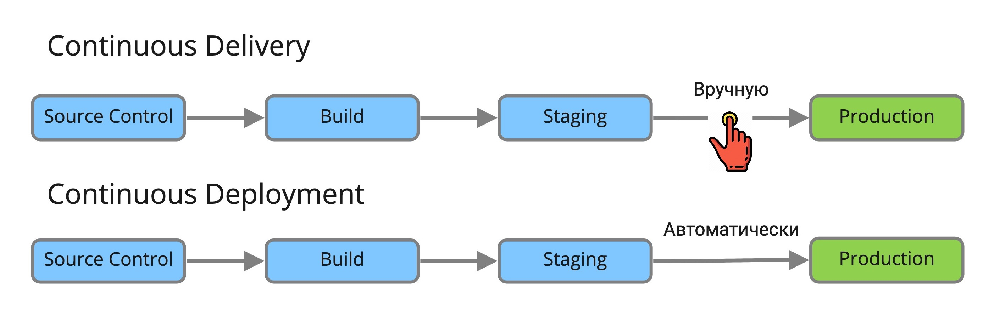

## CI / CD

1. Чем отличается Continuous Integration от Continuous Delivery от Continuous Deployment?

  
Ответ

Continuous Integration (непрерывная интеграция) - практика интеграции изменений кода из ветки разработки в основную ветку путём инструментов для интеграции.

Continuous Delivery (непрерывная доставка) - практика содержания кода в репозитории в состоянии пригодным для разворачивания на рабочее окружение.

Continuous Deployment (непрерывное разворачивание) - практика доставки каждого изменения в коде продукта на рабочее окружение.

Разница между Continuous Delivery и Continuous Deployment очень маленькая. Представим два пайплайна для одного и того же приложения. В каждом есть шаги:

1. Source Control - внесение изменений в систему контроля версий ПО.
2. Build - сборка приложения и прогон unit тестов
3. Staging - деплой на тестовое окружение, прогон интеграционных, нагрузочных и других тестов
4. Production - деплой на окружение с пользователями

Каждый пайплайн запускается автоматически по триггеру из системы контроля версий. В случае Continuous Deployment каждый следующий шаг, будет выполнен автоматически если предыдущий был успешный, включая деплой на Production.

Если же у вас Continuous Delivery, то шаги будут выполняться автоматически только в безопасной среде, а перед деплоем на Production пайплайн остановится и будет ждать ручного подтверждения. Механизм, как это будет реализовано может быть разным. От самого простого, когда ответственный человек должен зайти в пайплайн и нажать кнопку Next, до интерактивного бота с кнопками в корпоративном мессенджере.

2. Что означает конструкция `when: always` в stage блоке в gitlab CI?

  
Ответ

Данная конструкция означает, что stage будет запущен вне зависимости от успешности предыдущего шага.

3. Что выполняет конструкция `extends: .plan` в gitlab CI?

  
Ответ

`extends` используется для повторного использования секции пайплайна (аналог фунции). `.plan` указывает на имя повторяемой секции в пайплайне. Первым в шаге выполняется скрипт из `extends`.

4. В gitlab CI необходимо, чтобы джоба выполнялась всегда только при ручной активации. Что для этого необходимо сделать?

  
Ответ

Необходимо добавить `when: manual` в описание заданной джобы. По-умолчанию при использовании `when: manual` параметр `allow_failure` установлен в `true`, поэтому данная джоба будет запускаться автоматически. Чтобы такого не было необходимо также установить параметр `allow_failure: false`.

5. Опишите основные этапы CI/CD.

  
Ответ

6. Опишите пример процесса CI (и/или CD), который начинается с момента, когда разработчик запушил изменения/PR в Git

  
Ответ

  
* разработчик отпраляет коммит в репозиторий, создаёт merge request через сайт, или ещё каким-либо образом явно или неявно запускает пайплайн,
из конфигурации выбираются все задачи, условия которых позволяют их запустить в данном контексте,
* задачи организуются в соответствии со своими этапами,
* этапы по очереди выполняются — т.е. параллельно выполняются все задачи этого этапа,
* если этап завершается неудачей (т.е. завершается неудачей хотя бы одна из задач этапа) — пайплайн останавливается (почти всегда),
* если все этапы завершены успешно, пайплайн считается успешно прошедшим.

Таким образом, имеем:

* пайплайн — набор задач, организованных в этапы, в котором можно собрать, протестировать, упаковать код, развернуть готовую сборку в облачный сервис, и пр.,
* этап (stage) — единица организации пайплайна, содержит 1+ задачу,
* задача (job) — единица работы в пайплайне. Состоит из скрипта (обязательно), условий запуска, настроек публикации/кеширования артефактов и много другого.

Соответственно, задача при настройке CI/CD сводится к тому, чтобы создать набор задач, реализующих все необходимые действия для сборки, тестирования и публикации кода и артефактов.
  
  

